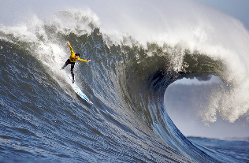
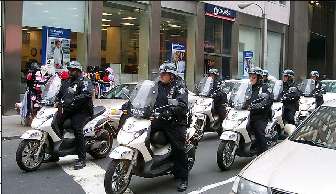
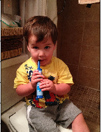

# Image Captioning

## Project Overview
In this work we have to combine Deep Convolutional Nets for image classification  with Recurrent Networks for sequence modeling, to create a single network that generates descriptions of image using [COCO Dataset - Common Objects in Context](http://cocodataset.org/).

COCO is a large image dataset designed for object detection, segmentation, person keypoints detection, stuff segmentation, and caption generation. GPU Accelerated Computing (CUDA) is neccessery for this project.

<p align="center">  </p> 

## Instructions
1. Clone this repo: https://github.com/cocodataset/cocoapi  
```
git clone https://github.com/cocodataset/cocoapi.git  
```

2. Setup the coco API (also described in the readme [here](https://github.com/cocodataset/cocoapi)) 
```
cd cocoapi/PythonAPI  
make  
cd ..
```

3. Download some specific data from here: http://cocodataset.org/#download (described below)

* Under **Annotations**, download:
  * **2017 Train/Val annotations [241MB]** (extract captions_train2017.json and captions_val2017.json, and place at locations cocoapi/annotations/captions_train2017.json and cocoapi/annotations/captions_val2017.json, respectively)  
  * **2017 Testing Image info [1MB]** (extract image_info_test2017.json and place at location cocoapi/annotations/image_info_test2017.json)
  

* Under **Images**, download:
  * **2017 Train images [118K/18GB]** (extract the train2017 folder and place at location cocoapi/images/train2017/)
  * **2017 Val images [5K/1GB]** (extract the val2017 folder and place at location cocoapi/images/val2017/)
  * **2017 Test images [41K/6GB]** (extract the test2017 folder and place at location cocoapi/images/test2017/)
## Project Structure
The project is structured as a series of Jupyter notebooks that are designed to be completed in sequential order:

__Notebook 0__ : Microsoft Common Objects in COntext (MS COCO) dataset;

__Notebook 1__ : Load and pre-process data from the COCO dataset;

__Notebook 2__ : Training the CNN-RNN Model;

__Notebook 3__ : Load trained model and generate predictions.

## Installation
```sh
$ git clone https://github.com/nalbert9/Image-Captioning.git
$ pip3 install -r requirements.txt
```

## Inference
Following are a few results obtained after training the model for 3 epochs.

Image | Caption 
--- | --- 
 | **Generated Caption:** a person riding a surf board on a wave
 | **Generated Caption:** a group of people riding motorcycles down a street
  | **Generated Caption:** a young boy brushing his teeth with a toothbrush
 | **Generated Caption:** a vase with a flower on a table

## References
[Microsoft COCO](https://arxiv.org/pdf/1405.0312.pdf), [arXiv:1411.4555v2 [cs.CV] 20 Apr 2015](https://arxiv.org/pdf/1411.4555.pdf) </li>
and [arXiv:1502.03044v3 [cs.LG] 19 Apr 2016](https://arxiv.org/pdf/1502.03044.pdf)

## Licence
This project is licensed under the terms of the [](https://opensource.org/licenses/MIT)
